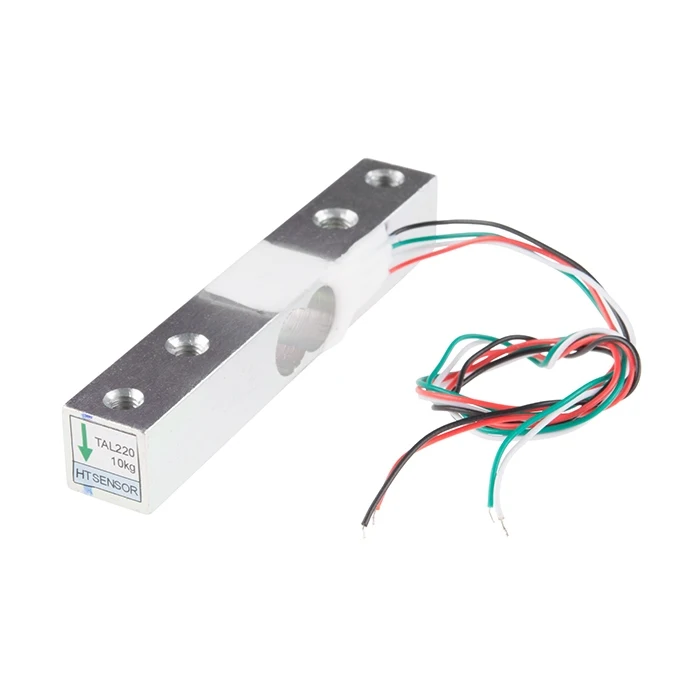
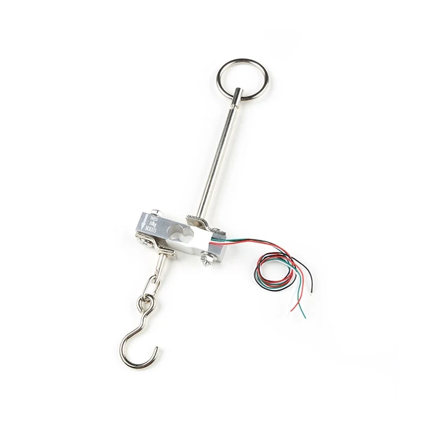
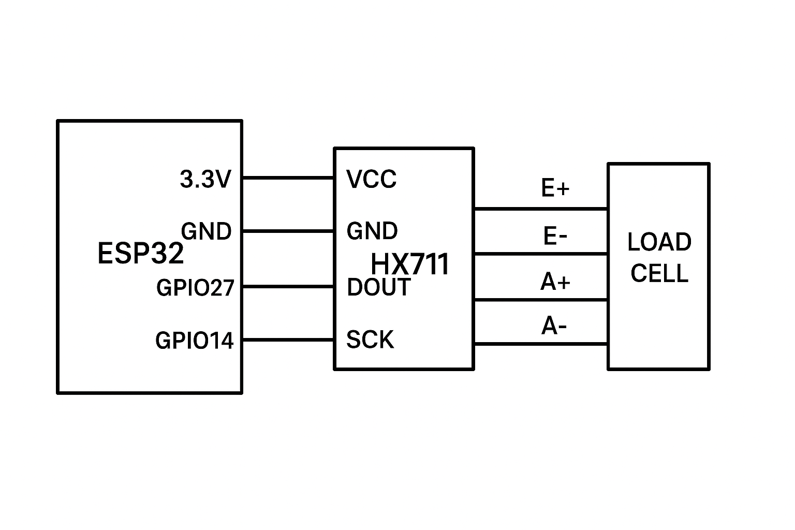
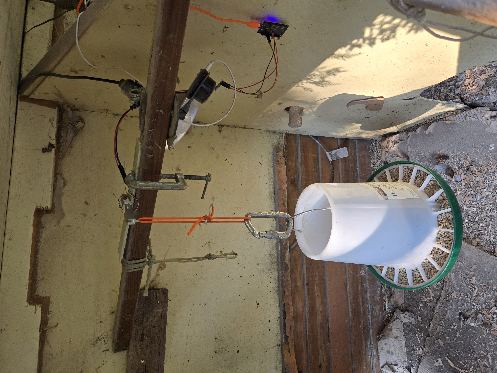

# Load Cell Chicken Coop Feeder Gauge

ESP32-based monitoring system for chicken coop feeders that measures the weight of feed using a load cell and provides a web interface to track feed levels.

## Overview

This project uses an ESP32 microcontroller connected to a load cell via an HX711 ADC to monitor the weight of a chicken feeder. The system provides a web interface with a gauge visualization showing the current feed level as a percentage. The project includes WiFi connectivity with a captive portal for easy setup, OTA updates, and a WebSerial interface for debugging and configuration.

Hanging the feeder in the coop helps to discourage pests (although rats can certainly jump up onto the feeder if they're really motivated).

## Features

- **Load Cell Monitoring**: Measures the weight of the chicken feeder using an HX711 load cell amplifier
- **Web Interface**: Displays feed level as a percentage on a gauge visualization
- **WiFi Connectivity**: Connects to your home network with easy setup via NetWizard captive portal
- **WebSerial Interface**: Provides command-line access for configuration and debugging
- **OTA Updates**: Supports over-the-air firmware updates via ElegantOTA
- **SPIFFS Storage**: Stores configuration and logs in flash memory
- **Double Reset Detection**: Reset WiFi configuration by pressing reset button twice within 10 seconds

## Hardware Requirements

- ESP32 development board (ESP32-DOIT-DEVKIT-V1) - sometimes a screw terminal board is easiest to use [Amazon Link](https://www.amazon.com/Development-Bluetooth-Microcontroller-ESP-WROOM-32-Breakout/dp/B0C8DBN29X/ref=sr_1_6)
- [HX711 load cell amplifier](https://www.sparkfun.com/products/13879)
- [Load cell (weight sensor)](https://www.sparkfun.com/products/14151)
- Power supply
- Mounting hardware for the load cell

## Wiring

- HX711 DOUT pin → ESP32 GPIO 27
- HX711 SCK pin → ESP32 GPIO 14
- Connect load cell to HX711. [Sparkfun](https://learn.sparkfun.com/tutorials/load-cell-amplifier-hx711-breakout-hookup-guide) has a good guide.

## Installation

1. Clone this repository
2. Open the project in [PlatformIO](https://platformio.org/)
3. Build and upload the filesystem image:
   - PlatformIO → Build Filesystem Image
   - PlatformIO → Upload Filesystem Image
4. Build and upload the firmware to your ESP32
- Note that the executable is fairly large; almost 4MB, so you may want to comment out definitions in platformio.ini if you don't need e.g. WebSerial. ElegantOTA is commented out but available if you modify and want to update the code without many trips to the coop :-)

## First-Time Setup

1. After the first upload, the ESP32 will start in AP mode with a NetWizard captive portal
2. Connect to the "COOPFEEDER" WiFi network from your phone or computer
3. Follow the on-screen instructions to connect the device to your home WiFi network
4. The device will restart and connect to your WiFi network
5. Place an empty feeder on the load cell
6. Calibrate the load cell with the empty feeder
   - Browse to `http://coopfeeder.local/config?empty` or
   - Use WebSerial at `http://coopfeeder.local/webserial` and enter the command `empty`
7. Fill the feeder to maximum capacity
   - Browse to `http://coopfeeder.local/config?full` or
   - Use WebSerial and enter the command `full`
  Your specific values will be saved in flash on the ESP32

  I had a bar load cell from another project. I fixed one end to a piece of flat fiberglass bar (and old sail batten), and clamped it in the coop. The feeder hangs from a split ring on the other end of the bar. The hanging-style load cell is probably easier to install.

  

## Web Interface

Access the web interface by navigating to `http://coopfeeder.local/` in your browser. The interface displays a gauge showing the current feed level as a percentage (0-100%)

## Configuration

You can configure the device using the WebSerial interface at `http://coopfeeder.local/webserial` or by using URL parameters:

### WebSerial Commands

- `empty` - Calibrate the load cell with an empty feeder
- `full` - Calibrate the load cell with a full feeder
- `hostname [name]` - Change the device hostname
- `timer [seconds]` - Change the web page update interval in seconds
- `ls` - List files in SPIFFS
- `status` - Show device status
- `wifi` - Show WiFi information
- `restart` - Restart the device
- `format` - Format the SPIFFS filesystem
- `conslog` - Restart the console log
- `log [on/off]` - Enable/disable serial logging
- `note [text]` - Add a note to the log
- `?` - Show available commands

### URL Configuration

- `http://coopfeeder.local/config?hostname=newname` - Change hostname
- `http://coopfeeder.local/config?webtimer=1000` - Change update interval (in milliseconds)
- `http://coopfeeder.local/config?empty` - Calibrate with empty feeder
- `http://coopfeeder.local/config?full` - Calibrate with full feeder

## API Endpoints

- `/readings` - Get current sensor readings as JSON
- `/weight` - Get current weight value as plain text
- `/host` - Get hostname and MAC address
- `/console.log` - Access the console log file

## Resetting WiFi Configuration

To reset the WiFi configuration and return to the captive portal setup:
1. Press the reset button on the ESP32
2. Within 10 seconds, press the reset button again
3. The device will clear WiFi settings and restart in AP mode

## Dependencies

- [AsyncTCP (3.3.5)](https://github.com/ESP32Async/AsyncTCP)
- [ESPAsyncWebServer (3.7.1)](https://github.com/ESP32Async/ESPAsyncWebServer)
- [ElegantOTA](https://github.com/ayushsharma82/ElegantOTA)
- [NetWizard](https://github.com/ayushsharma82/NetWizard)
- [WebSerialPro](https://github.com/ayushsharma82/WebSerial)
- [ArduinoJson (7.2.0)](https://github.com/bblanchon/ArduinoJson)
- [HX711_ADC](https://github.com/olkal/HX711_ADC)
- [gauges](https://github.com/bernii/gauge.js)

## Logs

A console log is stored on the SPIFFS filesystem and can be accessed via `http://coopfeeder.local/console.log`. This is mainly for debugging purposes.

## Resources

- [ESP32 Documentation](https://docs.espressif.com/projects/esp-idf/en/latest/esp32/)
- [HX711 Datasheet](https://cdn.sparkfun.com/datasheets/Sensors/ForceFlex/hx711_english.pdf)
- [PlatformIO Documentation](https://docs.platformio.org/)
- [SPIFFS Documentation](https://arduino-esp8266.readthedocs.io/en/latest/filesystem.html)

## Credits

This project depends heavily on the excellent utility libraries from [Ayush Sharma](https://github.com/ayushsharma82), as well as the lightweight Javascript gauge library from [Bernii](https://bernii.github.io/gauge.js/).